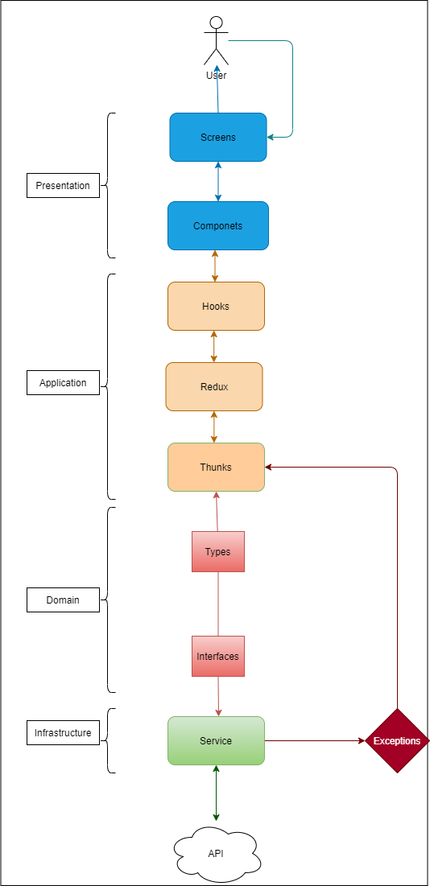

### Architecture

This diagram shows how the data flows through every subsystem of the app and how it manages inputs from external entities.

See the documentation folder for specific behaviors.

State management is done using <a href="https://redux-toolkit.js.org/usage/usage-guide">Redux Toolkit</a>

### Built With

# <a href="https://expo.dev/">Expo</a>

## Available Scripts

If Yarn was installed when the project was initialized, then dependencies will have been installed via Yarn, and you should probably use it to run these commands as well. Unlike dependency installation, command running syntax is identical for Yarn and NPM at the time of this writing.

## yarn start

Runs your app in development mode.

Open it in the Expo app on your phone to view it. It will reload if you save edits to your files, and you will see build errors and logs in the terminal.

Sometimes you may need to reset or clear the React Native packager's cache. To do so, you can pass the --reset-cache flag to the start script:

npm start --reset-cache

# or

yarn start --reset-cache
npm test
Runs the jest test runner on your tests.

## yarn ios

Like npm start, but also attempts to open your app in the iOS Simulator if you're on a Mac and have it installed.

## yarn android

Like npm start, but also attempts to open your app on a connected Android device or emulator. Requires an installation of Android build tools (see React Native docs for detailed setup). We also recommend installing Genymotion as your Android emulator. Once you've finished setting up the native build environment, there are two options for making the right copy of adb available to Create React Native App:

## Using Android Studio's adb

Make sure that you can run adb from your terminal.
Open Genymotion and navigate to Settings -> ADB. Select “Use custom Android SDK tools” and update with your Android SDK directory.
Using Genymotion's adb
Find Genymotion’s copy of adb. On macOS for example, this is normally /Applications/Genymotion.app/Contents/MacOS/tools/.
Add the Genymotion tools directory to your path (instructions for Mac, Linux, and Windows).
Make sure that you can run adb from your terminal.
npm run eject
This will start the process of "ejecting" from Create React Native App's build scripts. You'll be asked a couple of questions about how you'd like to build your project.

Warning: Running eject is a permanent action (aside from whatever version control system you use). An ejected app will require you to have an Xcode and/or Android Studio environment set up.
